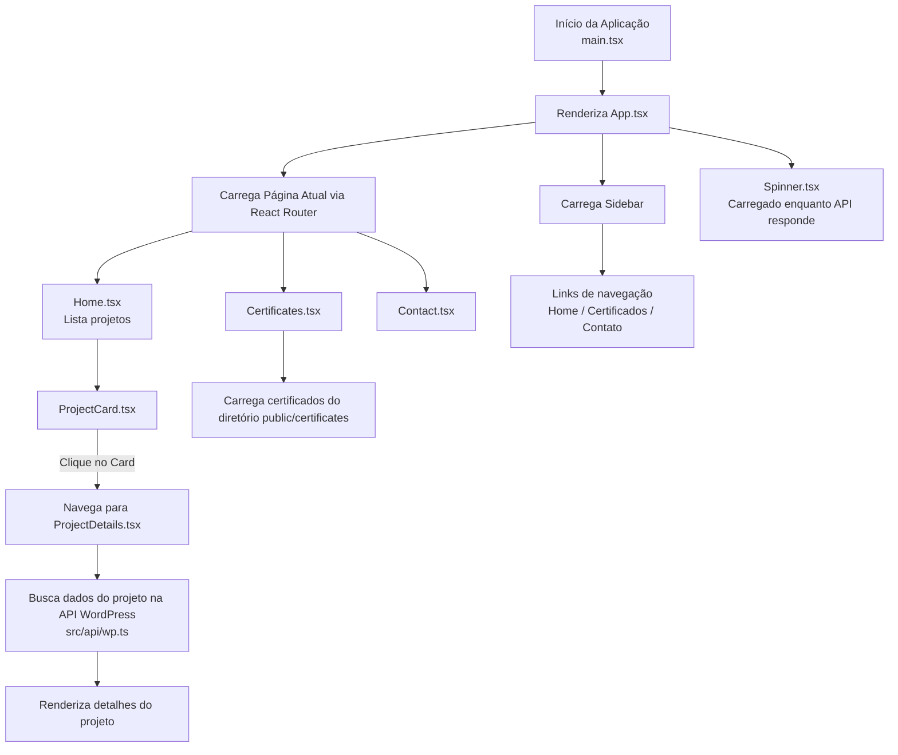

# React Portfolio + WordPress (FTP friendly)

- Vite + React + TypeScript
- HashRouter (funciona bem em hospedagem tradicional via FTP)
- Consumo da API do WordPress (WP v2 e ACF v3)
- Responsivo e performático (imagens `loading="lazy"`, layout em CSS Grid, build estático)

## Como usar

1. Renomeie `.env.example` para `.env` e ajuste as URLs de API do seu WordPress.
2. Instale as dependências:

```bash
npm i
```

3. Ambiente de desenvolvimento:

```bash
npm run dev
```

4. Build para produção (gera arquivos estáticos em `dist/`):

```bash
npm run build
```

5. Faça upload de **todo o conteúdo de `dist/`** para a sua hospedagem via FTP.

> Dica: Utilize `HashRouter` (já configurado). Assim, `seusite.com/#/certificados` funciona sem precisar configurar regras de servidor.

## Onde ajustar

- **Sidebar**: `src/components/Sidebar.tsx`
- **Listagem de projetos**: `src/pages/Home.tsx` + `src/components/ProjectCard.tsx`
- **Cliente WP**: `src/api/wp.ts`
- **Estilos**: `src/styles.css`

## API do WP

O projeto tenta buscar imagens em campos ACF (`acf.thumb`/`acf.image`), `better_featured_image` ou `_embedded` de `featuredmedia`. Sinta-se à vontade para adaptar o mapeamento em `getPostImage` conforme o seu schema.




