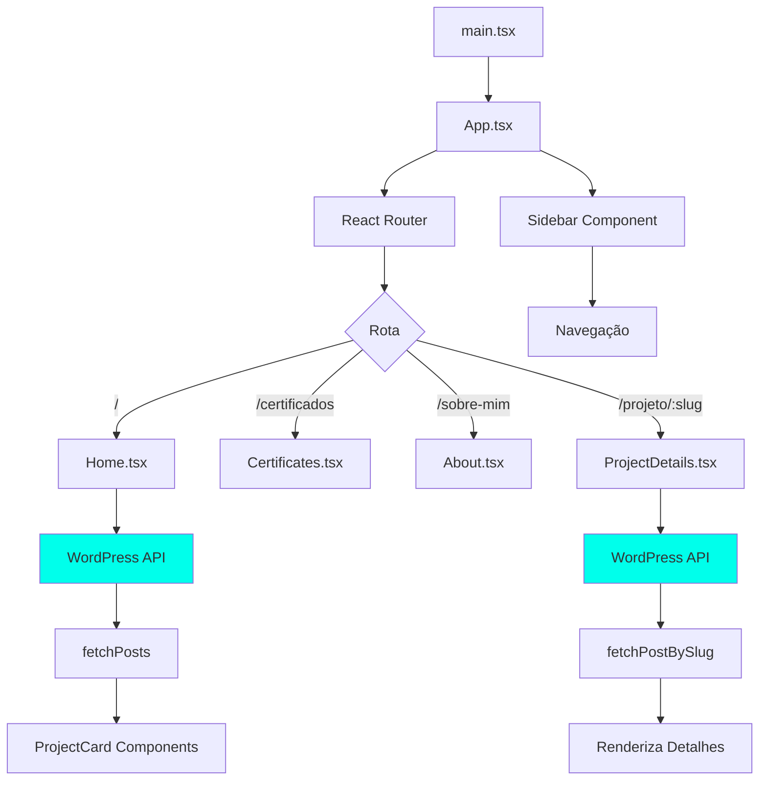
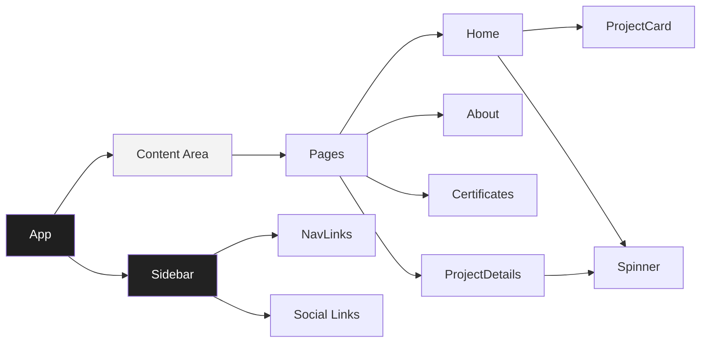

# 🎨 Portfolio Estático com WordPress API

Portfolio moderno e performático construído com React, TypeScript e SASS, consumindo dados do WordPress via REST API. Arquitetura otimizada para hospedagem tradicional via FTP.

## 📋 Sobre o Projeto

Este projeto é um portfólio profissional que demonstra boas práticas de desenvolvimento front-end moderno, incluindo:
- **Design System** completo com tokens de design (cores, espaçamento, tipografia)
- **Arquitetura modular** com componentes reutilizáveis
- **Type-safe** com TypeScript
- **Performance otimizada** com lazy loading e code splitting
- **SEO-friendly** com meta tags e estrutura semântica
- **100% Responsivo** com mobile-first approach

## 🛠️ Stack Tecnológico

### Core
- **React 18** - Biblioteca UI
- **TypeScript** - Type safety
- **Vite** - Build tool rápido
- **React Router** - Navegação SPA

### Styling
- **SASS/SCSS** - Pre-processador CSS
- **Design System** - Tokens e componentes padronizados
- **CSS Grid/Flexbox** - Layouts responsivos

### API & Data
- **WordPress REST API** (v2)
- **Advanced Custom Fields** (ACF v3)

### Quality & Tooling
- **ESLint** - Linting JavaScript/TypeScript
- **Prettier** - Formatação de código
- **Husky** - Git hooks
- **Lint-Staged** - Pre-commit validation

## 📁 Estrutura do Projeto

```
static-portfolio-2025/
├── src/
│   ├── api/                    # Cliente API WordPress
│   │   └── wp.ts              # Funções de fetch e tipos
│   ├── assets/                # Imagens estáticas
│   │   ├── profile.jpg
│   │   └── brand.png
│   ├── components/            # Componentes reutilizáveis
│   │   ├── ProjectCard.tsx   # Card de projeto
│   │   ├── Sidebar.tsx       # Menu lateral
│   │   └── Spinner.tsx       # Loading spinner
│   ├── pages/                 # Páginas da aplicação
│   │   ├── Home.tsx          # Listagem de projetos
│   │   ├── About.tsx         # Sobre mim
│   │   ├── Certificates.tsx  # Certificados
│   │   ├── Contact.tsx       # Contato
│   │   └── ProjectDetails.tsx # Detalhes do projeto
│   ├── styles/                # Design System (SASS)
│   │   ├── tokens/           # Design Tokens
│   │   │   ├── _colors.scss        # Paleta de cores
│   │   │   ├── _spacing.scss       # Espaçamento (múltiplos de 4)
│   │   │   ├── _typography.scss    # Tipografia
│   │   │   ├── _breakpoints.scss   # Media queries
│   │   │   └── _shadows.scss       # Sombras
│   │   ├── base/             # Estilos base
│   │   │   ├── _reset.scss        # Reset CSS
│   │   │   └── _global.scss       # Estilos globais
│   │   ├── utilities/        # Mixins e helpers
│   │   │   └── _mixins.scss       # Mixins reutilizáveis
│   │   ├── layouts/          # Layouts
│   │   │   └── _layout.scss       # Grid system
│   │   ├── components/       # Componentes SASS
│   │   │   ├── _sidebar.scss
│   │   │   ├── _nav.scss
│   │   │   ├── _card.scss
│   │   │   ├── _button.scss
│   │   │   ├── _spinner.scss
│   │   │   ├── _title.scss
│   │   │   └── _pages.scss
│   │   └── main.scss         # Entry point
│   ├── App.tsx               # Componente raiz
│   └── main.tsx              # Entry point React
├── public/
│   └── certificates/          # Certificados (PDFs e imagens)
├── dist/                      # Build de produção
├── .env.example              # Variáveis de ambiente (exemplo)
├── package.json
├── tsconfig.json
└── vite.config.ts

```

## 🎨 Design System

### Tokens de Design

#### Cores
```scss
// Principais
$color-brand: #00ffeb;
$color-dark: #1f1f1f;
$color-light: #f3f3f3;

// Escala de cinzas (50-900)
$color-gray-100, $color-gray-200, ..., $color-gray-900
```

#### Espaçamento (múltiplos de 4px)
```scss
$space-0: 0;      // 0px
$space-1: 4px;    // 4px
$space-2: 8px;    // 8px
$space-3: 12px;   // 12px
$space-4: 16px;   // 16px
$space-6: 24px;   // 24px
$space-8: 32px;   // 32px
$space-10: 40px;  // 40px
$space-16: 64px;  // 64px
```

#### Tipografia
```scss
// Tamanhos
$font-size-xs: 0.625rem;  // 10px
$font-size-sm: 0.75rem;   // 12px
$font-size-base: 1rem;    // 16px
$font-size-xl: 1.5rem;    // 24px

// Weights
$font-weight-medium: 500;
$font-weight-bold: 700;
$font-weight-black: 900;
```

## 🏗️ Arquitetura

### Padrões de Design

1. **Component-Based Architecture**
   - Componentes pequenos e reutilizáveis
   - Separação de responsabilidades (apresentação vs lógica)
   - Props typing com TypeScript

2. **Atomic Design System**
   - Tokens (cores, espaçamento, tipografia)
   - Componentes (sidebar, card, button)
   - Layouts (grid system, estrutura principal)

3. **API Integration Pattern**
   - Cliente centralizado (`src/api/wp.ts`)
   - Type-safe com interfaces TypeScript
   - Error handling consistente

4. **SASS Organization** (ITCSS-inspired)
   - **Tokens** → Design tokens (variáveis)
   - **Base** → Reset e estilos globais
   - **Utilities** → Mixins e funções
   - **Layouts** → Sistema de grid
   - **Components** → Componentes isolados

### Fluxo de Dados



### Arquitetura de Componentes



## 🚀 Como Usar

### 1. Configuração Inicial

```bash
# Clone o repositório
git clone <repo-url>
cd static-portfolio-2025

# Instale as dependências
npm install

# Configure variáveis de ambiente
cp .env.example .env
# Edite .env com suas URLs do WordPress
```

### 2. Desenvolvimento

```bash
# Inicia servidor de desenvolvimento
npm run dev

# Acesse http://localhost:5173
```

### 3. Build & Deploy

```bash
# Gera build de produção
npm run build

# Preview do build
npm run preview

# Faça upload da pasta dist/ via FTP
```

### 4. Linting & Formatação

```bash
# Verifica problemas de lint
npm run lint

# Auto-corrige problemas
npm run lint:fix

# Formata código
npm run format

# Executa lint + format de uma vez
npm run clean
```

## 📝 Scripts Disponíveis

| Script | Descrição |
|--------|-----------|
| `npm run dev` | Servidor de desenvolvimento |
| `npm run build` | Build de produção |
| `npm run preview` | Preview do build |
| `npm run lint` | Verifica problemas |
| `npm run lint:fix` | Corrige problemas automaticamente |
| `npm run format` | Formata código com Prettier |
| `npm run clean` | Lint + Format |

## 🔧 Configuração da API WordPress

### Variáveis de Ambiente (.env)

```env
VITE_WP_API_URL=https://seusite.com.br/wp-json/wp/v2
VITE_WP_ACF_URL=https://seusite.com.br/wp-json/acf/v3
```

### Campos ACF Esperados

```typescript
interface WPPost {
  id: number;
  slug: string;
  title: { rendered: string };
  content: { rendered: string };
  acf: {
    title_post?: string;
    image_post?: {
      url: string;
      sizes?: {
        medium?: string;
        large?: string;
      };
    };
    list_of_technologies?: TechnologyTag[];
  };
}
```

## 🎯 Features

- ✅ Design System completo com SASS
- ✅ TypeScript com type-safety total
- ✅ Integração com WordPress API
- ✅ Advanced Custom Fields (ACF)
- ✅ Lazy loading de imagens
- ✅ Animações suaves
- ✅ 100% Responsivo
- ✅ SEO otimizado
- ✅ Performance otimizada
- ✅ Git hooks (Husky + Lint-Staged)
- ✅ ESLint + Prettier configurados
- ✅ Build otimizado com Vite

## 📱 Responsividade

Breakpoints definidos:
- **sm**: 640px
- **md**: 768px
- **lg**: 960px
- **xl**: 1280px
- **2xl**: 1536px
